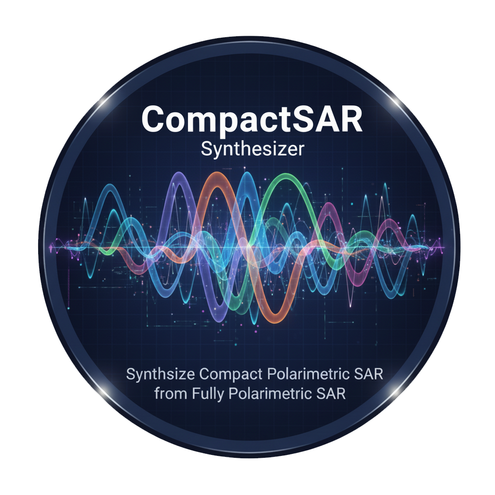

# CompactSAR Synthesizer


A desktop application for synthesizing Compact Polarimetric (CP) SAR data from Fully Polarimetric (FP) sources. This tool provides a user-friendly graphical interface (GUI) to process and convert SAR data for research and analysis.



## Overview

CompactSAR Synthesizer is a scientific tool designed to synthesize Compact Polarimetric SAR data from existing Fully Polarimetric datasets. This allows researchers to analyze and work with CP data modes, such as hybrid and π/4 modes, without needing native CP acquisitions. The application handles the entire workflow, from data ingestion and radiometric calibration to the generation of key polarimetric products.

This is an initial release of the software.

## Key Features

-   **Synthesizes** Compact Polarimetric data into **hybrid polarimetric** and **π/4** modes.
-   **Supports** data from major SAR missions: **RADARSAT-2** and **ALOS-PALSAR**.
-   Performs **radiometric calibration** on the input data.
-   Generates user-selectable outputs: the **Scattering Vector** or the **Covariance Matrix**.
-   Features a clean and intuitive Graphical User Interface (GUI).

## Supported Data

-   **Satellites:** RADARSAT-2, ALOS-PALSAR
-   **Input Format:** Data must be in **Single Look Complex (SLC)** format.

## Workflow

The application follows a standard processing chain:
1.  **Reads** the raw SLC image data.
2.  **Performs** radiometric calibration to convert pixel values to meaningful physical units.
3.  **Synthesizes** the selected Compact Polarimetric mode.
4.  **Generates** and saves the final data products (Scattering Vector and/or Covariance Matrix) as GeoTIFF files.

## Getting Started

Follow these instructions to get the application running on your local machine.

### Prerequisites

-   Python **3.10.0**
-   Pip (Python package installer)

### Installation & Usage

1.  **Clone the repository** to your local machine:
    ```bash
    git clone [https://github.com/mebrahimi2/CompactSAR-Synthesizer.git](https://github.com/mebrahimi2/CompactSAR-Synthesizer.git)
    ```

2.  **Navigate to the project directory**:
    ```bash
    cd CompactSAR-Synthesizer
    ```

3.  **Create and activate a virtual environment**:
    ```bash
    # Create the environment
    python -m venv venv

    # Activate on Windows
    .\venv\Scripts\activate

    # Activate on macOS/Linux
    source venv/bin/activate
    ```

4.  **Install the required libraries** using the `requirements.txt` file:
    ```bash
    pip install -r requirements.txt
    ```

5.  **Run the application**:
    ```bash
    python main.py
    ```
    The GUI shown in the screenshot above should now launch.

## License

This project is licensed under the **MIT License**.

The MIT License is a simple and permissive license. It allows others to do almost anything they want with your project, including making it part of their own closed-source software, as long as they include the original copyright and license notice. This is a great choice for academic and open-source projects.

## Acknowledgements

The application icon was designed and generated using Google AI Studio.